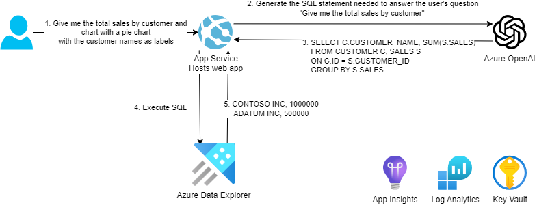
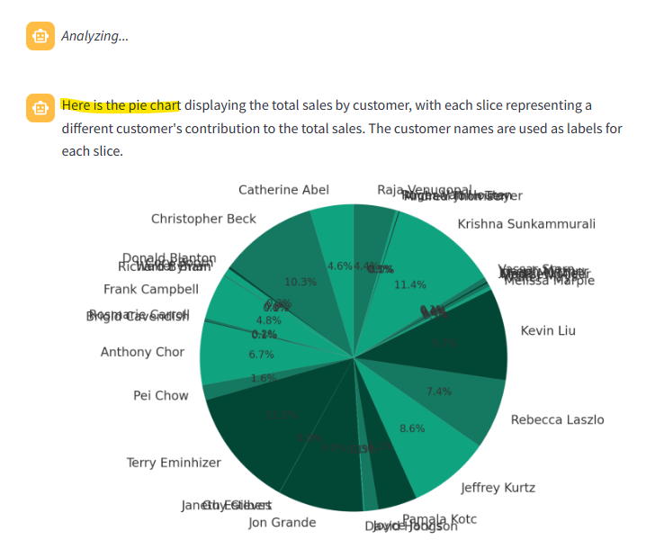

# Azure OpenAI Assistants Demo - ADX Chat

Attached here is code for a sample Streamlit application which can be used to demonstrate a pattern for conversational interaction with a ADX Database.

Briefly, we showcase how to utilize the Azure OpenAI Assistants API (specifically, the Function Calling & Code Interpreter capabilities) to retrieve schema for a target ADX database - in our testing we utilized the AdventureWorks Database deployed into a lightweight Azure ADX Database - then to assemble and execute ADX queries and provide text-based and graphical responses.

Here is a high-level description of what the flow of calls looks like.



Here is a more detailed sequence diagram.

## Disclaimer

**THE SOFTWARE IS PROVIDED "AS IS", WITHOUT WARRANTY OF ANY KIND, EXPRESS OR IMPLIED, INCLUDING BUT NOT LIMITED TO THE WARRANTIES OF MERCHANTABILITY, FITNESS FOR A PARTICULAR PURPOSE AND NONINFRINGEMENT. IN NO EVENT SHALL THE AUTHORS OR COPYRIGHT HOLDERS BE LIABLE FOR ANY CLAIM, DAMAGES OR OTHER LIABILITY, WHETHER IN AN ACTION OF CONTRACT, TORT OR OTHERWISE, ARISING FROM, OUT OF OR IN CONNECTION WITH THE SOFTWARE OR THE USE OR OTHER DEALINGS IN THE SOFTWARE.**

## Prerequisites

- [Azure CLI](https://docs.microsoft.com/en-us/cli/azure/install-azure-cli)
- [Azure Developer CLI](https://learn.microsoft.com/en-us/azure/developer/azure-developer-cli/overview)
- Azure subscription & resource group
- [Python 3.12](https://www.python.org/downloads/) - needed if running locally

### Setup

Running this demo successfully requires having access to a ADX database which can be reached from a client machine. For our development purposes, we utilized an Azure ADX Database loaded with the AdventureWorks dataset - this can be deployed directly from the Azure portal, and you can whitelist the IP address of the client machine running the demo.

Further, you will need to have an instance of Azure OpenAI deployed in a region which supports the Assistants API. The system message and functions associated with the deployment can be found in `assistants_sys_msg.txt`, `get_sql_db_schema.json`, and `query_sql_db.json`.

Create an updated `.env` with values from your ADX/Azure OpenAI resources using `sample.env` as a template.

### Running the Application locally

To start the Streamlit ADX Chat Application run the following command:

```shell
cd src

python -m venv ./.venv

./.venv/Scripts/activate

python -m pip install -r .\requirements.txt

python -m streamlit run app_assistants.py
```

### Deploy to Azure

Run the following command to deploy the entire solution to Azure.

```shell
azd up
```

### Demo

We can run human language queries against the database and let OpenAI generate the relevant ADX.

For instance:

```
I would like to get the total retail sales for 2020 by months
```

After issuing this query, we can see that the web app is querying the data dictionary of the database to get the schema of the data model.


Next, we can see it generate the correct ADX query and retrieve the data.


Finally, we can see it generate the pie chart

